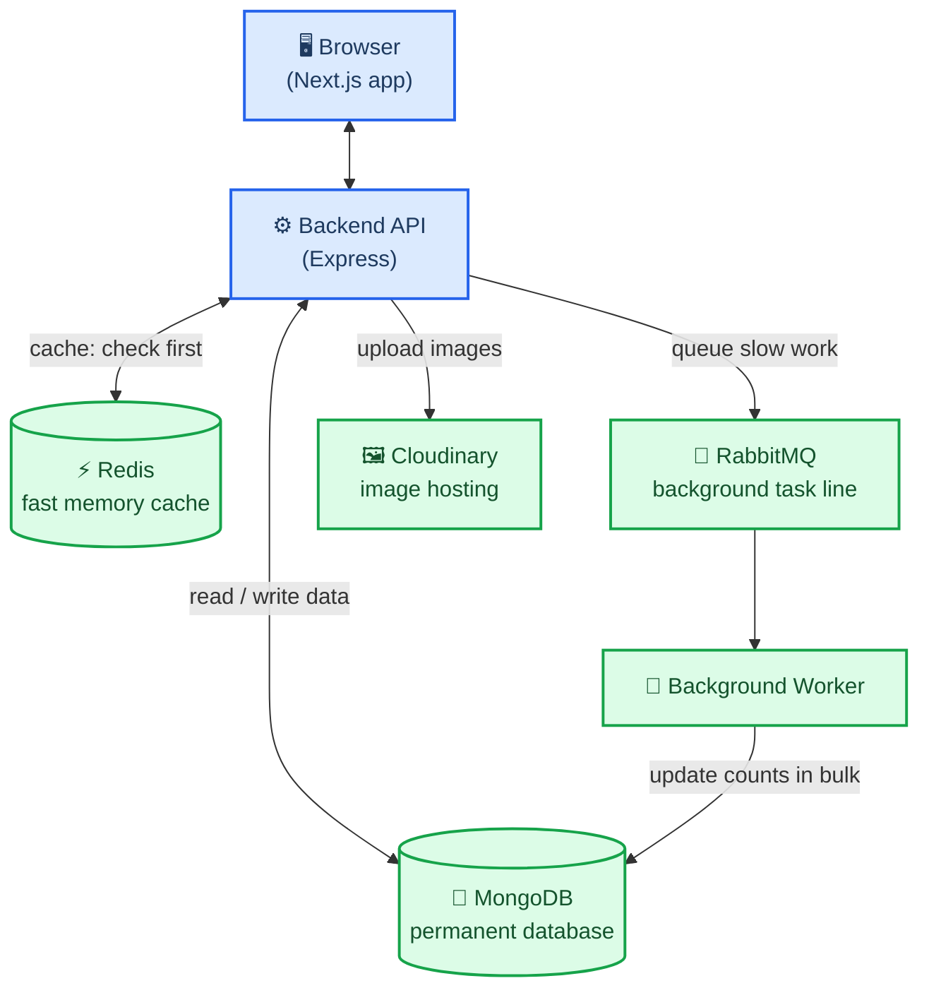
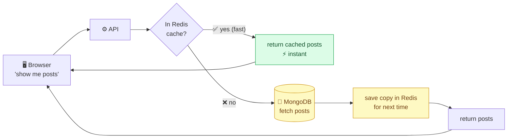
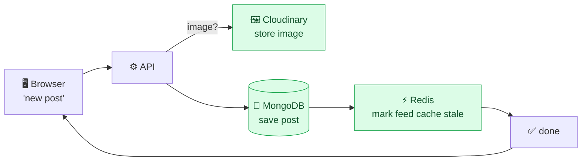
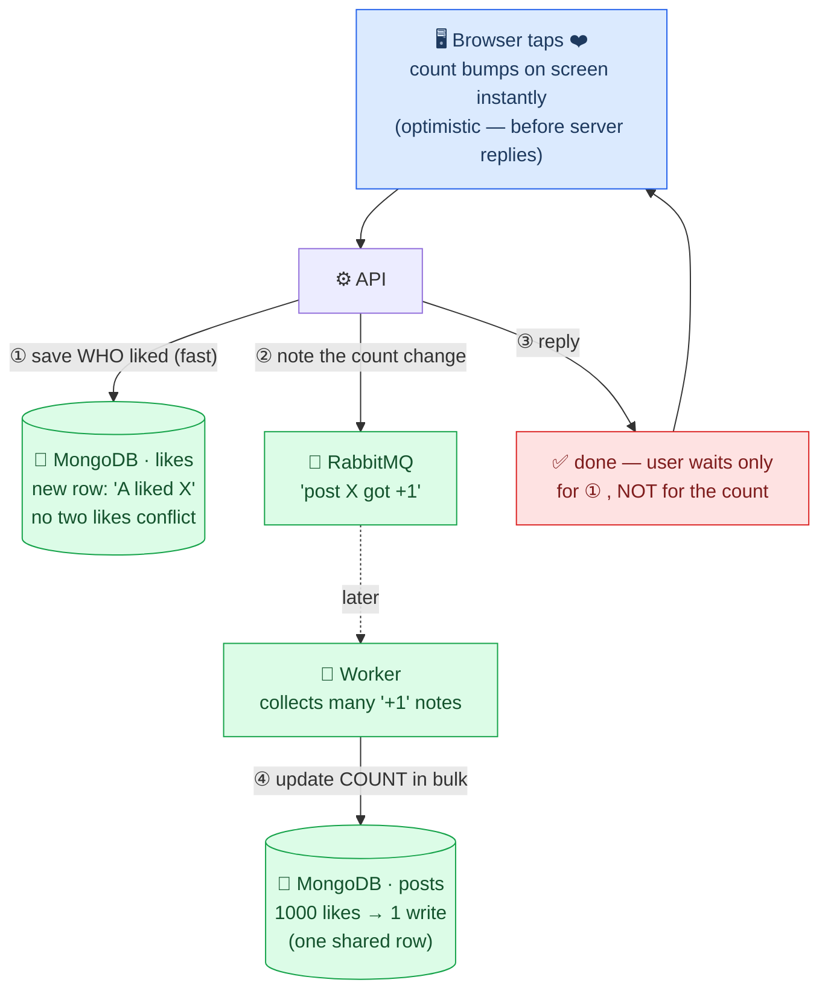
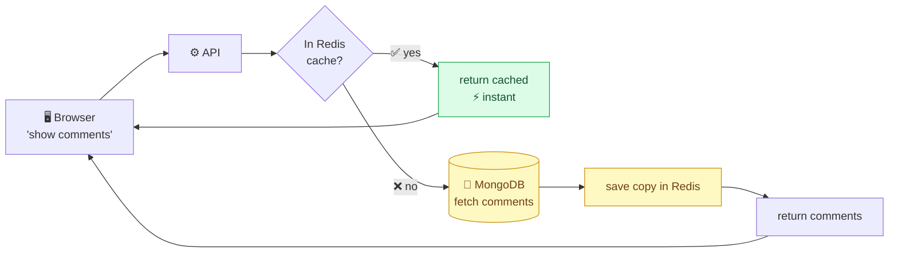
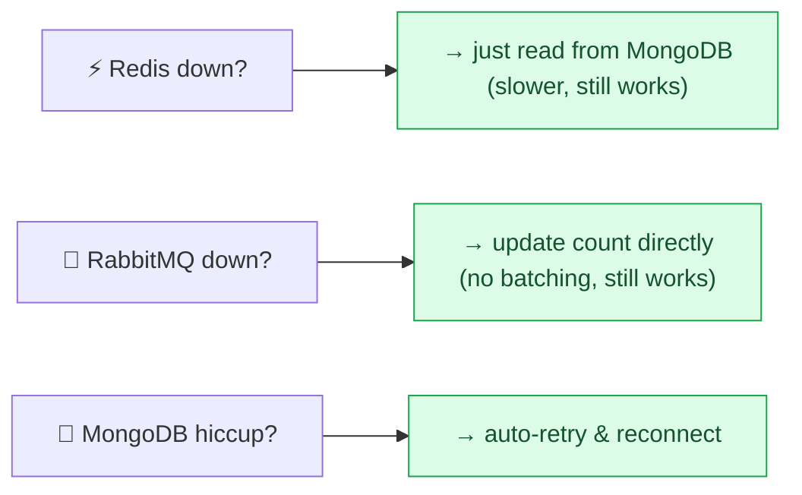

# Buddy Script — Architecture Diagrams (clean version)

Simplified for presentation. Each diagram shows only what's needed to tell the story.
White background. Render: VS Code preview, or regenerate PNGs with the command at the bottom.

---

## 1. The Big Picture — who talks to whom



**Explain:** *"The browser talks to one backend API. The API uses four tools: MongoDB stores
everything permanently, Redis is a fast memory cache for reads, RabbitMQ queues slow work, and
Cloudinary hosts images. A background worker handles queued tasks so the API stays fast."*

---

## 2. Reading the Feed — check cache first



**Explain:** *"When you load the feed, the API checks Redis first. If the posts are cached, you get
them instantly. If not, it reads MongoDB once, saves a copy in Redis, and the next person hits the
fast path. Most reads never touch the database."*

---

## 3. Creating a Post — save, then refresh the cache



**Explain:** *"Creating a post saves it to MongoDB, uploads any image to Cloudinary, then marks the
feed cache as stale so the new post shows up. Marking it stale is a single instant operation — I
don't delete every cached page one by one."*

---

## 4. Liking a Post — the smart part ⭐

Two DIFFERENT things get stored, not one thing twice:
- **WHO liked** → saved immediately (cheap: every like is a new row, no conflict).
- **The COUNT** (the number on the post) → updated later in bulk (expensive: every like hits the
  same row, so we batch to avoid hammering it).



**Explain:** *"Two different things are stored. First, the like record — 'user A liked post X' — saved
to MongoDB immediately. That's cheap because every like is a brand-new row, so two people liking the
same post never conflict. Second, the like COUNT — the number shown on the post. That's the expensive
one, because every like on the same post updates the same single field. So instead of updating it on
every tap, the API drops a note in RabbitMQ and replies right away. A background worker collects those
notes and updates the count in bulk — a viral post becomes one database write instead of thousands.
The user only waits for step ①; the count already moved on screen optimistically."*

---

## 5. Reading Comments — same cache trick as the feed



**Explain:** *"Comments use the exact same pattern as the feed — check Redis first, fall back to
MongoDB, and cache the result. The cache is tracked per-post, so a new comment on one post never
clears another post's cache."*

---

## 6. When a Helper Goes Down — nothing crashes



**Explain:** *"Every helper can fail without taking the app down. No Redis? Read from the database,
just slower. No RabbitMQ? Update counts directly. Database blip? Auto-reconnect. The app degrades
gracefully instead of crashing."*

---

### Regenerate the PNGs after editing
```
npx @mermaid-js/mermaid-cli -i ARCHITECTURE_DIAGRAMS.md -o architecture-diagrams/diagram.png -t default -b white
```
