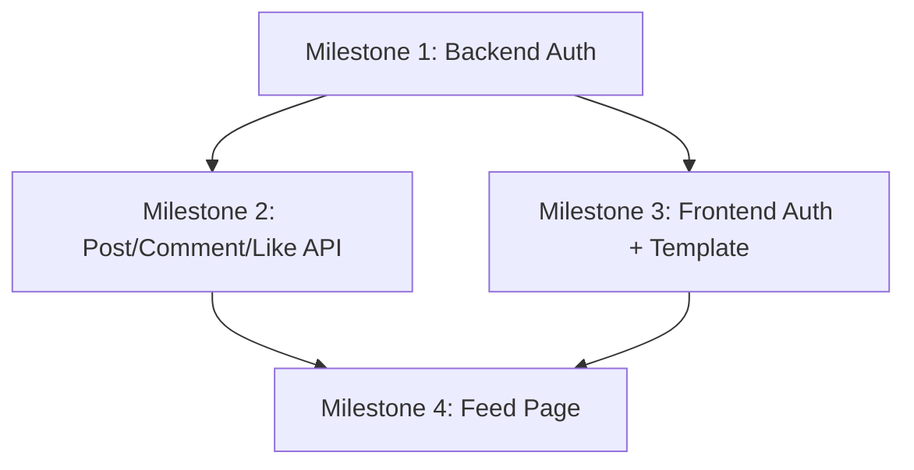

# BuddyScript Social Media Platform — Full Architecture Plan

> **Phase 2 Deliverable** — All 5 planning documents in a single reference.  
> Derived from: [requirements.txt](file:///d:/AppifyLab/project/requirements.txt) · [SYSTEM_ARCHITECTURE_GUIDE.md](file:///d:/AppifyLab/project/SYSTEM_ARCHITECTURE_GUIDE.md) · Template files (login, registration, feed)

---

## Table of Contents

- [A. PROJECT BLUEPRINT](#a-project-blueprint)
- [B. DATABASE SCHEMA](#b-database-schema)
- [C. API SPECIFICATION](#c-api-specification)
- [D. FRONTEND PLAN](#d-frontend-plan)
- [E. IMPLEMENTATION PLAN](#e-implementation-plan)

---

# A. PROJECT BLUEPRINT

## Project Summary & Goals

**BuddyScript** is a social media platform targeting students in Bangladesh. The MVP scope (per requirements) is:

1. **Authentication** — Register (firstName, lastName, email, password) + Login + Logout + Token refresh
2. **Feed** — Protected route, all public posts (newest-first), create posts (text + image), like/unlike posts, comments + replies with their own like systems, "who liked" display, public/private post visibility
3. **Performance** — Designed for millions of posts and reads (cursor-based pagination, Redis caching, async counter updates)

## Tech Stack Decision & Justification

| Layer | Technology | Justification |
|-------|-----------|---------------|
| **Frontend** | Next.js 16 (App Router) + React 19 | Required by spec ("React.js or Next.js"). Already scaffolded. SSR route protection via middleware. |
| **State Mgmt** | Redux Toolkit | Already installed. Complex cross-component state (auth, feed, UI modals) benefits from centralized store. |
| **HTTP Client** | Axios | Already installed. Interceptors for token refresh, consistent error handling. |
| **CSS** | Bootstrap 5 (from templates) + Poppins font + FontAwesome | Template already uses Bootstrap + custom CSS. Must preserve design exactly. |
| **Backend** | Node.js + Express 4 | Already scaffolded. Mature, battle-tested. Service-layer pattern from architecture guide. |
| **Database** | MongoDB (Mongoose 8) | Document-oriented, fits social media data patterns. Denormalized author snapshots avoid JOINs on hot paths. |
| **Cache** | Redis (ioredis) | Cache-first reads for feed, like state checks via Sets, session caching. |
| **Queue** | RabbitMQ (amqplib) | Async counter updates for likes/comments. Decouples write contention from user-facing latency. |
| **Image Storage** | Cloudinary | Free tier, CDN-backed, handles resize/transform. Already in dependencies. |
| **Auth** | JWT (access + refresh token pair) | Access token (15m) in memory, refresh token (7d) in httpOnly Secure cookie, hashed in DB. |
| **Validation** | Zod | Already in backend deps. Type-safe schema validation at API boundary. |

## High-Level Architecture

```
┌───────────────────────────────────────────────────────────────────┐
│                         CLIENT (Browser)                         │
│  Next.js 16 App Router ─ React 19 ─ Redux Toolkit ─ Axios       │
│  ┌─────────┐  ┌─────────┐  ┌────────────┐                       │
│  │ /login  │  │/register│  │   /feed    │ ← Protected route     │
│  └────┬────┘  └────┬────┘  └─────┬──────┘                       │
│       └────────────┴─────────────┘                               │
│                      │ HTTP (JSON + FormData)                    │
│                      ▼                                           │
├──────────────────────────────────────────────────────────────────┤
│                    BACKEND (Express Monolith)                    │
│  ┌──────────┐  ┌────────────┐  ┌──────────┐  ┌──────────────┐   │
│  │  Routes  │→│ Controllers │→│ Services  │→│   Models      │   │
│  └──────────┘  └────────────┘  └──────────┘  └──────┬───────┘   │
│                                      │              │            │
│                       ┌──────────────┼──────────────┤            │
│                       ▼              ▼              ▼            │
│                 ┌──────────┐  ┌──────────┐  ┌────────────┐       │
│                 │  Redis   │  │ RabbitMQ │  │  MongoDB   │       │
│                 │ (cache)  │  │ (queue)  │  │  (data)    │       │
│                 └──────────┘  └────┬─────┘  └────────────┘       │
│                                    │                             │
│                              ┌─────▼─────┐                      │
│                              │  Workers   │  (like.worker,       │
│                              │            │   notification.worker)│
│                              └────────────┘                      │
├──────────────────────────────────────────────────────────────────┤
│                    EXTERNAL SERVICES                             │
│              ┌──────────────┐                                    │
│              │  Cloudinary  │  (image upload / CDN)              │
│              └──────────────┘                                    │
└──────────────────────────────────────────────────────────────────┘
```

## Folder Structure (Existing — Verified)

```
project/
├── social-media-backend/
│   ├── server.js                    # Entry point ✅
│   ├── .env.example                 # ✅
│   ├── package.json                 # ✅ All deps installed
│   └── src/
│       ├── app.js                   # Express setup ✅
│       ├── config/                  # db, redis, rabbitmq, cloudinary, env
│       ├── constants/               # queue, cache, error constants
│       ├── controllers/             # auth, post, comment, like
│       ├── middlewares/             # auth, error, validate, rateLimit, upload
│       ├── models/                  # User, Post, Comment, Like, RefreshToken
│       ├── routes/                  # auth, post, comment, like, index
│       ├── services/               # auth, post, comment, like, cache, upload
│       ├── utils/                   # response, jwt, pagination, logger
│       ├── validators/              # auth, post, comment
│       └── workers/                 # like.worker, notification.worker
│
└── social-media-frontend/
    ├── middleware.js                 # Route protection ✅
    ├── app/
    │   ├── (auth)/login, register   # Auth pages
    │   ├── (protected)/feed         # Feed page
    │   ├── layout.js                # Root layout with Redux Provider
    │   ├── not-found.jsx            # 404 page
    │   └── page.js                  # Root redirect
    └── src/
        ├── api/                     # axiosInstance, auth, post, comment, like
        ├── components/              # auth/, feed/, post/, layout/, ui/
        ├── hooks/                   # useAuth, useFeed, useInfiniteScroll, useOptimisticLike
        ├── store/                   # Redux slices (auth, feed, ui)
        ├── styles/                  # globals.css
        └── utils/                   # formatDate, constants
```

## Authentication & Authorization Strategy

| Aspect | Implementation |
|--------|---------------|
| **Access Token** | JWT, 15-minute TTL, stored in Redux state (memory only) |
| **Refresh Token** | JWT, 7-day TTL, httpOnly + Secure + SameSite=Strict cookie, sha256-hashed in DB |
| **Login Flow** | POST /auth/login → verify credentials → issue both tokens → set cookie + return access token |
| **Refresh Flow** | POST /auth/refresh → read cookie → hash-match in DB → rotate (delete old, create new) → issue new pair |
| **Logout** | POST /auth/logout → delete refresh token from DB → clear cookie |
| **Route Protection** | Next.js middleware checks cookie presence → redirect to /login if missing |
| **API Auth** | Express middleware: extract Bearer token → verify → attach `req.user = { id, email }` |
| **Token Rotation** | Every refresh invalidates the old token and issues a new one (prevents replay) |

## Data Flow

```
Client Action → Axios (attach Bearer) → Express Route → Auth Middleware
→ Controller (extract req data) → Service (business logic, Redis check, DB query)
→ Response (sendSuccess/sendError format) → Axios Interceptor → Redux State → UI
```

## Third-Party Integrations

| Service | Purpose | Config |
|---------|---------|--------|
| **Cloudinary** | Image upload for posts, user avatars | SDK init in `config/cloudinary.js`, Multer middleware for multipart |
| **Google Fonts** | Poppins font family | CDN link in `<head>` |
| **Bootstrap 5** | Grid system, form controls, responsive utilities | CSS file from template |
| **FontAwesome 5** | Icons (from template fonts) | Font files in `public/fonts/` |

## Assumptions (Where Requirements Were Ambiguous)

> [!IMPORTANT]
> The following assumptions were made where requirements.txt was silent or ambiguous:

1. **No Google OAuth** — Template shows "Sign in with Google" button, but requirements say "session-based or JWT-based" and "no need to build features like forgot password." Assumption: Google OAuth is **visual only** (button present but non-functional), or entirely removed. Recommend removing to keep scope focused.
2. **Registration fields** — Template only has Email + Password + Repeat Password. Requirements say "first name, last name, email, password." **We must add firstName/lastName fields** to the registration form (template modification required).
3. **"Remember me" on login** — Template has this checkbox. Requirements don't mention it. Assumption: purely cosmetic, no functional impact (refresh token already provides persistence).
4. **"Forgot password"** — Requirements explicitly say "no need to build." We keep the link visually but it will be non-functional.
5. **Feed sidebar panels** — Template has Explore, Events, Recommendations, Friends. Requirements say "focus only on the main functionality of the feed." Assumption: these are **static/cosmetic** — we won't build backend for them.
6. **Stories section** — Template has story cards. Not in requirements. Assumption: static/cosmetic only.
7. **Notifications, Chat, Friends** — Template navbar has icons for these. Not in requirements. Assumption: icons remain but are non-functional.
8. **Dark mode** — Template supports it via CSS class toggle. We'll preserve it as it's already in the template CSS.
9. **Post image is optional** — Requirements say "text and image." Assumption: image is optional, text is required.
10. **Max reply depth = 1** — Architecture guide says comment → reply only (no nested replies). We enforce this.

---

# B. DATABASE SCHEMA

## Design Principles

- **Embed** what is always read together (author snapshot on Post/Comment)
- **Reference** what grows unbounded (comments, likes → separate collections)
- **Denormalize counters** (likeCount, commentCount on Post) — async-updated by RabbitMQ workers
- **No `$lookup` on hot paths** — everything for feed display is in the Post document
- **Compound indexes** per actual query patterns
- **Soft-delete** with `isDeleted` flag (never physically delete data)
- **Cursor-based pagination** using `(createdAt, _id)` — never use `skip()`

---

### B.1 — `users` Collection

| Field | Type | Constraints | Default |
|-------|------|-------------|---------|
| `_id` | ObjectId | Auto PK | — |
| `firstName` | String | required, min 2, max 50 | — |
| `lastName` | String | required, min 2, max 50 | — |
| `email` | String | required, unique, lowercase, indexed | — |
| `passwordHash` | String | required, bcrypt, never returned | — |
| `avatar.url` | String | Cloudinary URL | `null` |
| `avatar.publicId` | String | For Cloudinary deletion | `null` |
| `isActive` | Boolean | Soft-delete flag | `true` |
| `createdAt` | Date | Mongoose timestamps | auto |
| `updatedAt` | Date | Mongoose timestamps | auto |

**Indexes:** `{ email: 1 }` (unique), `{ createdAt: -1 }`

**Instance Methods:**
- `toPublicJSON()` — returns user object without `passwordHash`

**Static Methods:**
- `findByEmail(email)` — finds active user by lowercase email

---

### B.2 — `refresh_tokens` Collection

| Field | Type | Constraints | Default |
|-------|------|-------------|---------|
| `_id` | ObjectId | Auto PK | — |
| `userId` | ObjectId | ref: users, indexed | — |
| `token` | String | sha256 hash, unique | — |
| `expiresAt` | Date | TTL index (auto-purge) | — |
| `userAgent` | String | Device tracking | — |
| `ip` | String | Request IP | — |
| `createdAt` | Date | Mongoose timestamps | auto |

**Indexes:** `{ token: 1 }` (unique), `{ userId: 1 }`, `{ expiresAt: 1 }` (TTL)

---

### B.3 — `posts` Collection ⭐ (Most Critical)

| Field | Type | Constraints | Default |
|-------|------|-------------|---------|
| `_id` | ObjectId | Auto PK | — |
| `author._id` | ObjectId | ref: users | — |
| `author.firstName` | String | Denormalized snapshot | — |
| `author.lastName` | String | Denormalized snapshot | — |
| `author.avatarUrl` | String | Denormalized snapshot | — |
| `content` | String | required, max 2000 | — |
| `image.url` | String | Cloudinary CDN URL | `null` |
| `image.publicId` | String | For deletion | `null` |
| `image.width` | Number | — | — |
| `image.height` | Number | — | — |
| `visibility` | String | enum: `['public','private']` | `'public'` |
| `likeCount` | Number | Async-updated by worker | `0` |
| `commentCount` | Number | Async-updated by worker | `0` |
| `isDeleted` | Boolean | Soft-delete flag | `false` |
| `createdAt` | Date | Mongoose timestamps | auto |
| `updatedAt` | Date | Mongoose timestamps | auto |

**Indexes:**
- `{ visibility: 1, isDeleted: 1, createdAt: -1, _id: -1 }` — public feed query
- `{ 'author._id': 1, visibility: 1, createdAt: -1 }` — user's own posts
- `{ createdAt: -1, _id: -1 }` — cursor pagination

**Feed Query Pattern (cursor-based, NO skip):**
```js
// Page 1
{ visibility: 'public', isDeleted: false }
  .sort({ createdAt: -1, _id: -1 }).limit(20)

// Next page
{ visibility: 'public', isDeleted: false,
  $or: [
    { createdAt: { $lt: cursorDate } },
    { createdAt: cursorDate, _id: { $lt: cursorId } }
  ]
}.sort({ createdAt: -1, _id: -1 }).limit(20)
```

---

### B.4 — `comments` Collection

| Field | Type | Constraints | Default |
|-------|------|-------------|---------|
| `_id` | ObjectId | Auto PK | — |
| `postId` | ObjectId | ref: posts, indexed | — |
| `parentId` | ObjectId \| null | null = top-level, ObjectId = reply | `null` |
| `depth` | Number | 0 = comment, 1 = reply (max enforced) | `0` |
| `author._id` | ObjectId | ref: users | — |
| `author.firstName` | String | Denormalized | — |
| `author.lastName` | String | Denormalized | — |
| `author.avatarUrl` | String | Denormalized | — |
| `content` | String | required, max 1000 | — |
| `likeCount` | Number | Async-updated | `0` |
| `replyCount` | Number | Only on depth-0 | `0` |
| `isDeleted` | Boolean | Soft-delete | `false` |
| `createdAt` | Date | timestamps | auto |
| `updatedAt` | Date | timestamps | auto |

**Indexes:**
- `{ postId: 1, parentId: 1, createdAt: 1 }` — fetch comments for a post
- `{ postId: 1, depth: 1, createdAt: 1 }` — depth-based queries
- `{ 'author._id': 1 }` — user's comments

---

### B.5 — `likes` Collection (High Volume)

| Field | Type | Constraints | Default |
|-------|------|-------------|---------|
| `_id` | ObjectId | Auto PK | — |
| `userId` | ObjectId | ref: users | — |
| `targetId` | ObjectId | postId OR commentId | — |
| `targetType` | String | enum: `['post','comment']` | — |
| `createdAt` | Date | timestamps | auto |

**Indexes:**
- `{ userId: 1, targetId: 1, targetType: 1 }` — **unique** (prevent duplicates)
- `{ targetId: 1, targetType: 1, createdAt: -1 }` — fetch likers
- `{ userId: 1, targetType: 1, createdAt: -1 }` — user's like history

---

### B.6 — Index Summary

| Collection | Key Indexes |
|------------|-------------|
| `users` | `email` (unique), `createdAt` |
| `refresh_tokens` | `token` (unique), `userId`, `expiresAt` (TTL) |
| `posts` | `(visibility, isDeleted, createdAt, _id)`, `(author._id, visibility, createdAt)` |
| `comments` | `(postId, parentId, createdAt)`, `(postId, depth, createdAt)` |
| `likes` | `(userId, targetId, targetType)` unique, `(targetId, targetType, createdAt)` |

### Migration Strategy

Mongoose handles schema enforcement at the application level. Indexes are defined in schema files and created on server startup via `mongoose.model()`. No explicit migration files needed — Mongoose's `ensureIndexes()` runs automatically.

---

# C. API SPECIFICATION

## Unified Response Format

All endpoints return this format — no exceptions:

```json
// Success
{
  "success": true,
  "message": "Description",
  "data": { ... },
  "pagination": { "nextCursor": "...", "hasMore": true }
}

// Error
{
  "success": false,
  "message": "Error description",
  "code": "ERROR_CODE",
  "errors": []
}
```

## Error Code Standards

| Code | HTTP Status | Meaning |
|------|-------------|---------|
| `AUTH_TOKEN_EXPIRED` | 401 | Access token expired |
| `AUTH_TOKEN_INVALID` | 401 | Malformed or tampered token |
| `AUTH_UNAUTHORIZED` | 401 | No token provided |
| `AUTH_DUPLICATE_EMAIL` | 409 | Email already registered |
| `AUTH_INVALID_CREDENTIALS` | 401 | Wrong email/password |
| `VALIDATION_ERROR` | 400 | Request body failed validation |
| `NOT_FOUND` | 404 | Resource not found |
| `FORBIDDEN` | 403 | Not authorized for this action |
| `RATE_LIMITED` | 429 | Too many requests |
| `SERVER_ERROR` | 500 | Internal server error |

## Pagination Strategy

All list endpoints use **cursor-based pagination**:
- `?cursor=<encoded>&limit=<N>` (default limit=20, max limit=50)
- Cursor encodes `(createdAt, _id)` of last item
- Response includes `pagination.nextCursor` and `pagination.hasMore`

---

### C.1 — Auth Endpoints

#### `POST /api/auth/register`
| Aspect | Detail |
|--------|--------|
| **Auth** | Public |
| **Rate Limit** | 3 requests / hour / IP |
| **Request Body** | `{ firstName: string, lastName: string, email: string, password: string }` |
| **Validation** | firstName (2-50), lastName (2-50), email (valid format), password (min 8, 1 uppercase, 1 number) |
| **Success (201)** | `{ user: { id, firstName, lastName, email }, accessToken }` + sets `refreshToken` cookie |
| **Errors** | 400 (validation), 409 (duplicate email) |

#### `POST /api/auth/login`
| Aspect | Detail |
|--------|--------|
| **Auth** | Public |
| **Rate Limit** | 5 requests / 15 min / IP |
| **Request Body** | `{ email: string, password: string }` |
| **Success (200)** | `{ user: { id, firstName, lastName, email, avatarUrl }, accessToken }` + sets `refreshToken` cookie |
| **Errors** | 400 (validation), 401 (invalid credentials) |

#### `POST /api/auth/refresh`
| Aspect | Detail |
|--------|--------|
| **Auth** | Cookie-based (reads `refreshToken` httpOnly cookie) |
| **Success (200)** | `{ accessToken }` + sets new `refreshToken` cookie (rotation) |
| **Errors** | 401 (no cookie / invalid / expired / hash mismatch) |

#### `POST /api/auth/logout`
| Aspect | Detail |
|--------|--------|
| **Auth** | Authenticated (Bearer token) |
| **Success (200)** | `{ message: "Logged out" }` + clears `refreshToken` cookie + deletes token from DB |

#### `GET /api/auth/me`
| Aspect | Detail |
|--------|--------|
| **Auth** | Authenticated |
| **Success (200)** | `{ user: { id, firstName, lastName, email, avatarUrl, createdAt } }` |

---

### C.2 — Post Endpoints

#### `GET /api/posts/feed`
| Aspect | Detail |
|--------|--------|
| **Auth** | Authenticated |
| **Query Params** | `cursor?: string, limit?: number (default 20, max 50)` |
| **Success (200)** | `{ posts: [...], pagination: { nextCursor, hasMore } }` |
| **Notes** | Only returns `visibility: 'public', isDeleted: false`. Redis-cached (60s TTL). Also includes the current user's own posts (both public & private). |

#### `POST /api/posts`
| Aspect | Detail |
|--------|--------|
| **Auth** | Authenticated |
| **Content-Type** | `multipart/form-data` |
| **Request Body** | `content: string (required, max 2000), image?: file (jpeg/png/webp, max 5MB), visibility?: 'public'|'private' (default 'public')` |
| **Success (201)** | `{ post: { ...full post object } }` |
| **Side Effects** | Upload image to Cloudinary, publish `post.created` to RabbitMQ, invalidate feed cache |

#### `GET /api/posts/:postId`
| Aspect | Detail |
|--------|--------|
| **Auth** | Authenticated |
| **Success (200)** | `{ post: { ...full post with isLiked boolean for current user } }` |
| **Errors** | 404, 403 (if private and not author) |

#### `DELETE /api/posts/:postId`
| Aspect | Detail |
|--------|--------|
| **Auth** | Authenticated (author only) |
| **Success (200)** | `{ message: "Post deleted" }` (soft delete) |
| **Errors** | 404, 403 (not author) |

---

### C.3 — Comment Endpoints

#### `GET /api/posts/:postId/comments`
| Aspect | Detail |
|--------|--------|
| **Auth** | Authenticated |
| **Query Params** | `cursor?, limit? (default 20)` |
| **Success (200)** | `{ comments: [top-level only, parentId=null], pagination }` |

#### `POST /api/posts/:postId/comments`
| Aspect | Detail |
|--------|--------|
| **Auth** | Authenticated |
| **Request Body** | `{ content: string (required, max 1000) }` |
| **Success (201)** | `{ comment: {...} }` |
| **Side Effects** | Publish `comment.created` to RabbitMQ |

#### `GET /api/comments/:commentId/replies`
| Aspect | Detail |
|--------|--------|
| **Auth** | Authenticated |
| **Query Params** | `cursor?, limit? (default 10)` |
| **Success (200)** | `{ replies: [...], pagination }` |

#### `POST /api/comments/:commentId/replies`
| Aspect | Detail |
|--------|--------|
| **Auth** | Authenticated |
| **Request Body** | `{ content: string (required, max 1000) }` |
| **Validation** | Parent must be depth=0 (max depth enforcement) |
| **Success (201)** | `{ reply: {...} }` |

---

### C.4 — Like Endpoints

#### `POST /api/likes/toggle`
| Aspect | Detail |
|--------|--------|
| **Auth** | Authenticated |
| **Request Body** | `{ targetId: string, targetType: 'post'|'comment' }` |
| **Success (200)** | `{ isLiked: boolean, likeCount: number }` |
| **Side Effects** | Write to likes collection, publish to RabbitMQ, update Redis set |

#### `GET /api/likes/:targetType/:targetId`
| Aspect | Detail |
|--------|--------|
| **Auth** | Authenticated |
| **Query Params** | `cursor?, limit? (default 50)` |
| **Success (200)** | `{ likers: [{ id, firstName, lastName, avatarUrl }], pagination }` |

---

### C.5 — Rate Limiting Summary

| Endpoint | Limit |
|----------|-------|
| `POST /auth/login` | 5 req / 15 min / IP |
| `POST /auth/register` | 3 req / hour / IP |
| Global `/api/*` | 100 req / 15 min / IP |

---

# D. FRONTEND PLAN

## Template Integration Strategy

> [!IMPORTANT]
> The templates use **Bootstrap 5 + custom CSS (Poppins font, utility classes, dark mode)** with class naming convention `_prefix_name`. We must preserve this design system exactly.

### Approach: **Convert to React components, keep all CSS classes intact**

1. **Copy template CSS files** (`common.css`, `main.css`, `responsive.css`, `bootstrap.min.css`) into `src/styles/` or `public/`
2. **Copy template assets** (images, fonts, SVGs) into `public/` directory
3. **Convert HTML → JSX** preserving all class names, structure, and styling
4. **Replace static data** with dynamic data from Redux state and API calls
5. **Keep dark mode toggle** (CSS class `_dark_wrapper` toggled via React state)
6. **DO NOT use Tailwind for template pages** — use the existing Bootstrap + custom CSS

## Component Breakdown

### Login Page (`/login`)

| Component | Source | Notes |
|-----------|--------|-------|
| `LoginForm` | [login.html](file:///d:/AppifyLab/project/template/login.html) L61-96 | Email + Password inputs, Login button |
| Background shapes | [login.html](file:///d:/AppifyLab/project/template/login.html) L27-38 | Decorative SVGs |
| Logo | [login.html](file:///d:/AppifyLab/project/template/login.html) L52 | BuddyScript logo |
| Google button | Template L56-58 | **Non-functional** (visual only, per Assumption #1) |
| Link to register | Template L100 | `<Link href="/register">` |

### Register Page (`/register`)

| Component | Source | Notes |
|-----------|--------|-------|
| `RegisterForm` | [registration.html](file:///d:/AppifyLab/project/template/registration.html) L64-100 | **Must add firstName + lastName fields** (not in template) |
| Same layout as login | Same shapes, logo pattern | |

> [!WARNING]
> **Template gap**: Registration template only has Email + Password + Repeat Password. Requirements mandate firstName + lastName. We must add 2 input fields to match the requirement while keeping the same CSS styling pattern (`_social_registration_form_input`).

### Feed Page (`/feed`)

| Component | Template Section | Description |
|-----------|-----------------|-------------|
| `Navbar` | [feed.html](file:///d:/AppifyLab/project/template/feed.html) L51-549 | Logo, search, nav icons, profile dropdown with logout |
| `MobileMenu` | L552-589 | Mobile header |
| `MobileBottomNav` | L592-652 | Bottom navigation bar |
| `LeftSidebar` | L659-825 | Explore links, Events (static) |
| `CreatePostArea` | L984-1086 | Textarea + Photo/Video/Event/Article + Post button |
| `PostCard` | L1087-1300+ | Author info, content, image, reactions, comments |
| `PostActions` | L1190-1300+ | Like/Comment/Share buttons + reaction counts |
| `CommentSection` | L1340+ | Comment list with reply support |
| `RightSidebar` | L1500+ | Friends list, recommendations (static) |
| `DarkModeToggle` | L28-47 | Sun/moon icon toggle |
| `InfiniteScrollTrigger` | New | IntersectionObserver for pagination |
| `PostSkeleton` | New | Loading skeleton for feed |
| `CreatePostModal` | New (or inline) | Extended create-post with image upload + visibility toggle |
| `LikeButton` | New | Optimistic like/unlike with heart icon |
| `LikeList` | New | Modal showing who liked |
| `CommentItem` | New | Single comment with like + reply |
| `ReplyItem` | New | Single reply with like |

## State Management (Redux Toolkit)

```js
// authSlice
{
  user: { id, firstName, lastName, email, avatarUrl } | null,
  accessToken: string | null,
  isAuthenticated: boolean,
  loading: boolean
}

// feedSlice
{
  posts: [],
  nextCursor: string | null,
  hasMore: boolean,
  loading: boolean,
  creating: boolean
}

// uiSlice
{
  createPostModal: boolean,
  likeListModal: { open: boolean, targetId?, targetType? },
  toast: { message: string, type: 'success'|'error', visible: boolean },
  darkMode: boolean
}
```

## API Integration Map Per Page

| Page | API Calls | Trigger |
|------|-----------|---------|
| `/login` | `POST /auth/login` | Form submit |
| `/register` | `POST /auth/register` | Form submit |
| `/feed` (mount) | `GET /auth/me` + `GET /posts/feed` | Page load |
| `/feed` (scroll) | `GET /posts/feed?cursor=...` | IntersectionObserver |
| `/feed` (create) | `POST /posts` | Post button |
| `/feed` (like) | `POST /likes/toggle` | Like button click |
| `/feed` (who liked) | `GET /likes/:type/:id` | Click on like count |
| `/feed` (comments) | `GET /posts/:id/comments` | Open comment section |
| `/feed` (add comment) | `POST /posts/:id/comments` | Submit comment |
| `/feed` (replies) | `GET /comments/:id/replies` | Click "replies" |
| `/feed` (add reply) | `POST /comments/:id/replies` | Submit reply |
| `/feed` (delete) | `DELETE /posts/:id` | Delete from dropdown (author only) |
| `/feed` (logout) | `POST /auth/logout` | Navbar logout button |

## Form Validation (Client-Side)

| Form | Field | Rule |
|------|-------|------|
| Login | email | Required, valid email format |
| Login | password | Required, min 1 char |
| Register | firstName | Required, 2-50 chars |
| Register | lastName | Required, 2-50 chars |
| Register | email | Required, valid email |
| Register | password | Required, min 8, 1 uppercase, 1 number |
| Register | repeatPassword | Must match password |
| Create Post | content | Required, max 2000 chars |
| Create Post | image | Optional, max 5MB, jpeg/png/webp |
| Create Post | visibility | `public` or `private` |
| Comment | content | Required, max 1000 chars |

## Auth Flow

```
1. App loads → check Redux for accessToken
2. If no token → middleware redirects to /login
3. Login success → store token in Redux → redirect to /feed
4. Feed loads → GET /auth/me to hydrate user → GET /posts/feed
5. API call returns 401 → interceptor calls /auth/refresh → retry
6. Refresh fails → dispatch logout() → redirect to /login
7. Logout → POST /auth/logout → clear Redux → redirect to /login
```

## Responsive Considerations

- Template already has `responsive.css` with breakpoints for mobile/tablet/desktop
- Mobile bottom navigation bar replaces desktop navbar on small screens
- Story cards collapse into horizontal scroll on mobile
- Post create area simplifies on mobile (icon-only buttons)

## Accessibility

- All form inputs have `<label>` elements (from template)
- Interactive elements are keyboard-navigable (Bootstrap defaults)
- Color contrast maintained per template's design system

## New Pages/Components Beyond Templates

| Item | Reason |
|------|--------|
| `PostSkeleton` | Loading state (pulse animation) — not in template |
| `LikeList` modal | "Who liked" feature — not in template |
| `InfiniteScrollTrigger` | Pagination — not in template |
| `CreatePostModal` (enhanced) | Image upload + visibility toggle — template only has basic textarea |
| `Toast` component | Success/error notifications |
| `Spinner` component | Button loading states |

---

# E. IMPLEMENTATION PLAN

## Phased Development (4 Milestones)

---

### Milestone 1: Backend Foundation & Auth _(Priority: MUST DO FIRST)_

**Goal:** Fully working auth system that frontend can integrate with.

| # | Task | Complexity | Dependency | Status |
|---|------|-----------|------------|--------|
| 1.1 | Verify/fix all config files (db, redis, rabbitmq, cloudinary, env) | S | — | |
| 1.2 | Verify/fix all 5 Mongoose models match schema spec | M | — | |
| 1.3 | Verify/fix utils (response, jwt, pagination, logger) | S | — | |
| 1.4 | Verify/fix validators (auth, post, comment) | S | — | |
| 1.5 | Verify/fix auth middleware + error middleware | S | — | |
| 1.6 | Implement/verify auth.service.js (register, login, refresh, logout, getMe) | L | 1.1-1.5 | |
| 1.7 | Implement/verify auth.controller.js | S | 1.6 | |
| 1.8 | Implement/verify auth.routes.js with rate limiters | S | 1.7 | |
| 1.9 | Test auth flow end-to-end (register → login → refresh → me → logout) | M | 1.8 | |

**Definition of Done:**
- `POST /auth/register` creates user, returns token + sets cookie
- `POST /auth/login` authenticates, returns token + sets cookie
- `POST /auth/refresh` rotates token
- `GET /auth/me` returns current user (protected)
- `POST /auth/logout` clears session
- All responses use `sendSuccess`/`sendError` format
- Rate limiters active on login/register

---

### Milestone 2: Post, Comment & Like Backend _(Priority: SECOND)_

**Goal:** Complete CRUD API for posts, comments, replies, and likes.

| # | Task | Complexity | Dependency | Status |
|---|------|-----------|------------|--------|
| 2.1 | Implement/verify cache.service.js (Redis abstractions) | M | 1.1 | |
| 2.2 | Implement/verify upload.service.js (Cloudinary) | S | 1.1 | |
| 2.3 | Implement/verify upload.middleware.js (Multer, 5MB, MIME filter) | S | — | |
| 2.4 | Implement/verify post.service.js (create, getFeed, getPost, delete, getMyPosts) | L | 2.1-2.3 | |
| 2.5 | Implement/verify post.controller.js + post.routes.js | M | 2.4 | |
| 2.6 | Implement/verify comment.service.js (add, reply, getComments, getReplies) | L | 2.1 | |
| 2.7 | Implement/verify comment.controller.js + comment.routes.js | M | 2.6 | |
| 2.8 | Implement/verify like.service.js (toggle, getLikers, getLikeState) | L | 2.1 | |
| 2.9 | Implement/verify like.controller.js + like.routes.js | M | 2.8 | |
| 2.10 | Implement/verify queue constants + RabbitMQ publishing | M | 1.1 | |
| 2.11 | Implement/verify like.worker.js (batch counter updates) | M | 2.10 | |
| 2.12 | Implement/verify notification.worker.js (feed cache invalidation) | S | 2.10 | |
| 2.13 | Test all endpoints end-to-end | L | 2.5-2.12 | |

**Definition of Done:**
- Create post (text + optional image + visibility)
- Feed returns paginated public posts (cursor-based)
- Private posts visible only to author
- Comments and replies CRUD
- Like toggle for posts and comments
- "Who liked" endpoint
- Workers process events from RabbitMQ
- All responses paginated where applicable

---

### Milestone 3: Frontend Auth + Template Integration _(Priority: THIRD)_

**Goal:** Login, Register, and base layout working with real API.

| # | Task | Complexity | Dependency | Status |
|---|------|-----------|------------|--------|
| 3.1 | Copy template CSS + assets into Next.js public/ and styles/ | M | — | |
| 3.2 | Set up axiosInstance with interceptors (token attach, 401 refresh, queue) | L | — | |
| 3.3 | Set up Redux store with authSlice, feedSlice, uiSlice | M | — | |
| 3.4 | Create API modules (auth.api, post.api, comment.api, like.api) | M | 3.2 | |
| 3.5 | Convert login.html → LoginForm component (JSX + controlled inputs) | M | 3.1 | |
| 3.6 | Convert registration.html → RegisterForm (**add firstName/lastName**) | M | 3.1 | |
| 3.7 | Wire login/register forms to API → store token → redirect to /feed | M | 3.4-3.6 | |
| 3.8 | Implement layout.jsx with Redux Provider, font imports | S | 3.3 | |
| 3.9 | Verify middleware.js route protection (already exists) | S | — | |
| 3.10 | Create Navbar component from feed.html template (with logout) | M | 3.1 | |
| 3.11 | Create Toast notification component | S | 3.3 | |
| 3.12 | Test auth flow in browser (register → login → protected route → logout) | M | 3.7-3.11 | |

**Definition of Done:**
- Login page pixel-matches template design
- Register page has firstName/lastName + template design
- Form validation shows inline errors
- Successful auth redirects to /feed
- Protected routes redirect to /login if unauthenticated
- Logout clears session and redirects
- Toast shows on errors

---

### Milestone 4: Feed Page Full Implementation _(Priority: FOURTH)_

**Goal:** Complete feed page with all required functionality.

| # | Task | Complexity | Dependency | Status |
|---|------|-----------|------------|--------|
| 4.1 | Convert feed.html layout → FeedContainer (3-column layout) | L | 3.10 | |
| 4.2 | Build PostCard component (author, content, image, timestamp, visibility) | L | 4.1 | |
| 4.3 | Build PostSkeleton (loading animation) | S | — | |
| 4.4 | Build CreatePostModal (textarea, image upload, visibility toggle, char counter) | L | 3.4 | |
| 4.5 | Build PostActions (like button, comment count, like count) | M | — | |
| 4.6 | Implement useOptimisticLike hook | M | 3.4 | |
| 4.7 | Build LikeButton with optimistic UI | M | 4.6 | |
| 4.8 | Build LikeList modal (who liked) | M | 3.4 | |
| 4.9 | Build CommentSection (fetch + display comments, add comment input) | L | 3.4 | |
| 4.10 | Build CommentItem (with like + reply trigger) | M | 4.9 | |
| 4.11 | Build ReplyItem (with like) | M | 4.10 | |
| 4.12 | Implement InfiniteScrollTrigger (IntersectionObserver) | M | — | |
| 4.13 | Implement useFeed hook (Redux thunks for fetchFeed, fetchNextPage) | L | 3.3-3.4 | |
| 4.14 | Wire all components together: feed loads on mount, scroll loads more | L | 4.1-4.13 | |
| 4.15 | Handle empty state, error state, loading state | S | 4.14 | |
| 4.16 | Build left sidebar (static explore/events from template) | S | 4.1 | |
| 4.17 | Build right sidebar (static friends/recommendations) | S | 4.1 | |
| 4.18 | Implement dark mode toggle | S | 4.1 | |
| 4.19 | Full integration testing in browser | L | 4.1-4.18 | |
| 4.20 | Write README.md with setup instructions | S | 4.19 | |

**Definition of Done:**
- Feed loads public posts (newest first) with infinite scroll
- Create post with text + optional image + visibility toggle
- Like/unlike posts and comments (optimistic UI)
- View who liked any post/comment
- Comments and replies working
- Private posts visible only to author
- Dark mode toggle works
- Empty/loading/error states handled
- All template design preserved

---

## Dependency Map



## Risk Register

| Risk | Impact | Likelihood | Mitigation |
|------|--------|------------|------------|
| Redis/RabbitMQ not installed locally | Blocks backend startup | Medium | Make Redis/RabbitMQ optional — app falls back to direct DB writes with warnings in dev mode |
| Cloudinary free tier rate limits | Blocks image uploads during testing | Low | Use local file storage fallback in dev, or mock upload service |
| Template CSS conflicts with Next.js/Tailwind | Breaks design | High | Load template CSS via `<link>` in layout, disable Tailwind for template pages or scope it |
| Registration template missing name fields | Design inconsistency | Certain | Add fields using same CSS class pattern (`_social_registration_form_input`) |
| MongoDB connection issues | Blocks everything | Medium | Clear error messages on startup, .env.example with setup instructions |
| Large feed.html (125KB) template conversion | Time-consuming | Certain | Focus on required sections only (post area, navbar) — ignore non-functional sections |

---

## Open Questions

> [!IMPORTANT]
> Please clarify these before I begin implementation:

1. **Google OAuth button** — Should we keep it as a visual-only button, hide it entirely, or implement Google OAuth? The requirements don't mention OAuth.

2. **Redis & RabbitMQ availability** — Do you have Redis and RabbitMQ installed locally, or should I make them optional (graceful degradation) for development?

3. **Cloudinary credentials** — Do you have a Cloudinary account set up, or should I implement a local file storage fallback for development?

4. **Tailwind CSS** — The frontend already has Tailwind 4 installed. The templates use Bootstrap + custom CSS. Should we:
   - (a) Remove Tailwind and use only template CSS?
   - (b) Keep both (Tailwind for new components, Bootstrap for template components)?

5. **Feed page scope** — The template has extensive features (stories, events, groups, chat, notifications, friend requests, profile pages). Per requirements, we "may ignore most design elements — focus only on main functionality." Should we:
   - (a) Render the full template layout (sidebars, stories) but keep them static?
   - (b) Show only the core post feed area (simplified layout)?

---

## Verification Plan

### Automated Tests
```bash
# Backend: verify server starts and connects
cd social-media-backend && node -e "require('./src/app')"

# Frontend: verify build succeeds
cd social-media-frontend && npm run build
```

### Manual Verification
- Register a new user → verify user created in MongoDB
- Login → verify tokens issued, cookie set
- Create post with image → verify Cloudinary upload + feed display
- Like/unlike → verify optimistic UI + counter updates
- Comment + Reply → verify nested display
- Private post → verify only author can see
- Token refresh → verify seamless re-auth
- Logout → verify session cleared
